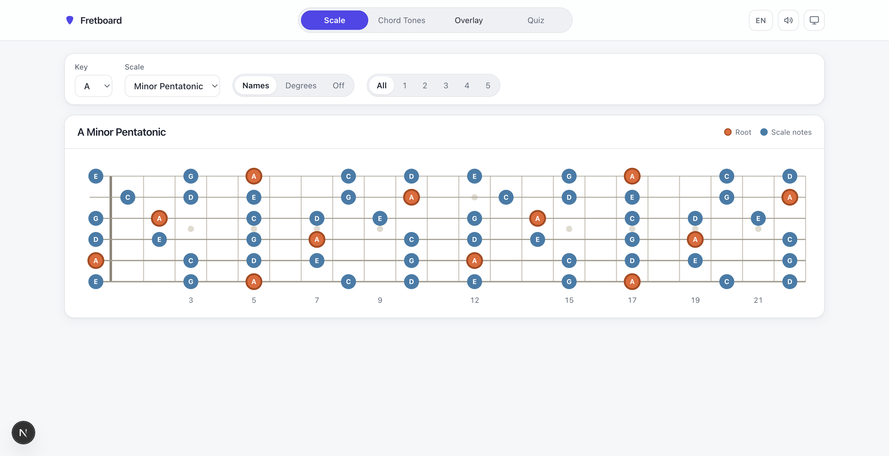
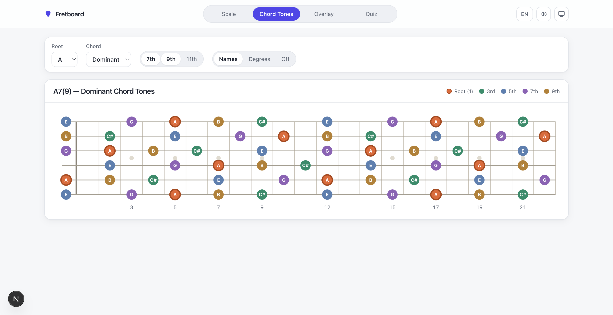
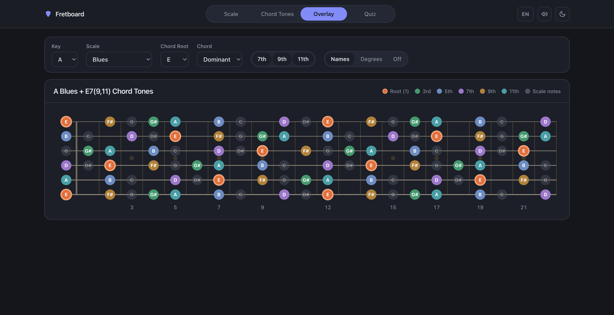
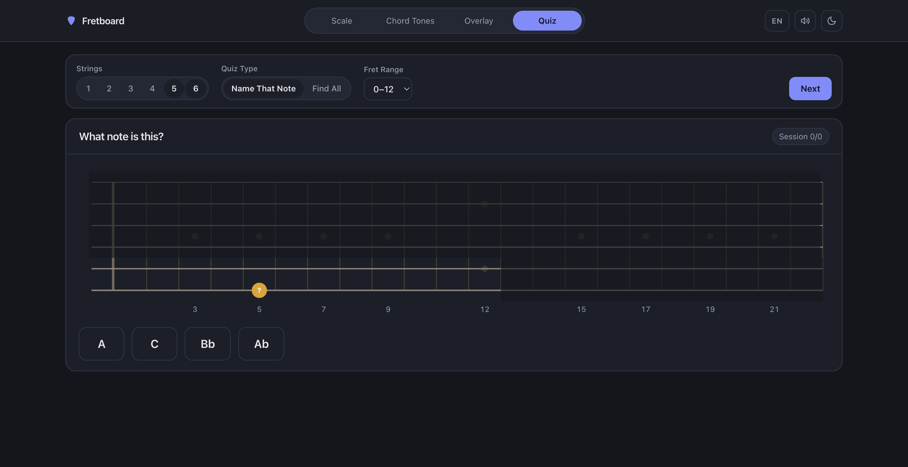

# Fretboard — *i wanna be john mayer* 🎸

A guitar fretboard trainer for learning scales, chord tones, and the notes on the neck — built for players who want to *see* the fretboard the way great improvisers do.

**▶ Live demo: [i-wanna-be-john-mayer.vercel.app](https://i-wanna-be-john-mayer.vercel.app)**



## Features

### 🎼 Scale Explorer
Visualize five scales (Major, Natural Minor, Minor Pentatonic, Major Pentatonic, Blues) in any of the 12 keys across the full 22-fret neck. Switch note labels between names, scale degrees, or a clean unlabeled view, and isolate the five pentatonic box positions.

### 🎯 Chord Tones with Extensions
Pick a root and a chord quality — **Major, Minor, Dominant, Diminished, Half-diminished, or Augmented** — and the triad (1 · 3 · 5, with ♭5/♯5 where the quality calls for it) lights up in degree colors. Toggle the **7th, 9th, 11th, and 13th** independently to stack extensions onto the neck, and on Dominant chords unlock the **altered tensions ♭9 · ♯9 · ♯11 · ♭13** for jazz voicings; the title, legend, and URL stay in sync (`A7(b9,#9)`, `Bdim7`, `Am7b5` …). The 7th automatically follows the quality (maj7 vs ♭7 vs 𝄫7).



### 🫥 Overlay Mode
Lay chord tones over a dimmed scale to practice targeting chord tones while soloing — with an independent chord root, so you can see, say, E7 arpeggio notes inside the A blues scale.



### 🧠 Quiz Mode
Two drills for learning the neck:
- **Name That Note** — a position lights up, you pick the note name from four choices.
- **Find All** — click every occurrence of a note within your practice range.

Scope questions to specific strings and fret ranges, and track session and lifetime accuracy plus average answer time.



### And more

- 🔊 **Sound** — every note you click is played through the Web Audio API (toggleable).
- 🌗 **Theming** — light and dark themes with system-preference tracking and no flash on load.
- 🌐 **i18n** — English by default with a one-click Korean toggle, covering every label down to screen-reader hints.
- 🔗 **Shareable URLs** — the entire view state is encoded in the query string, so any board you set up can be bookmarked or shared.
- ♿ **Accessibility** — keyboard-operable quiz targets, ARIA-labeled controls, focus management, WCAG AA color contrast, and `prefers-reduced-motion` support.

## Tech Stack

| | |
|---|---|
| Framework | [Next.js 15](https://nextjs.org) (App Router) + React 19 |
| Styling | [Tailwind CSS v4](https://tailwindcss.com) (CSS-first config, design tokens, dual theme) |
| Language | TypeScript |
| Testing | [Vitest](https://vitest.dev) + Testing Library — 150+ tests over the theory engine, URL codec, and components |
| Audio | Web Audio API (no dependencies) |

The music-theory core (`src/theory`) is a small pure-function library — pitch-class math, key-aware note spelling (F♯ vs G♭), scale/chord formulas, and pentatonic box windows — fully unit-tested and independent of the UI.

## Getting Started

```bash
npm install
npm run dev      # http://localhost:3000
```

```bash
npm test         # run the full test suite
npm run build    # production build (use a clean .next/ when deploying)
```

## Project Structure

```
app/                # Next.js entry — layout (theme/FOUC script), page shell
src/
  theory/           # Pure music-theory engine (notes, scales, chords, boxes)
  quiz/             # Quiz question engine + persistent stats
  audio/            # Web Audio tone playback
  components/       # Fretboard SVG, controls, quiz, legend, toggles
  lib/              # URL state codec, theme utils, i18n dictionaries
docs/               # Design specs and implementation plans for every feature
```

Every feature in this repo was built spec-first: the design documents and step-by-step implementation plans live in [`docs/superpowers/`](docs/superpowers/).
